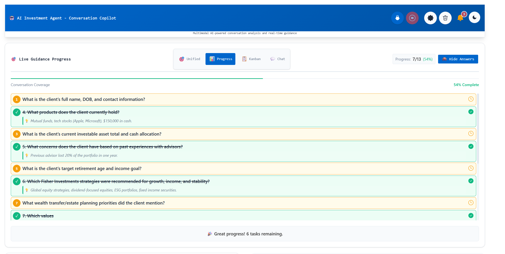

# Investment Agent - Conversation Copilot with Multimodal Azure AI

**🚀 Enhanced with Modern UI Layouts and Advanced Investment Intelligence**

Inves3.	**Prepare and run the frontend app (in frontend folder)**
    +	Go to frontend directory and run `npm install` to install dependencies.
    +	Update the backend API endpoint in the frontend configuration if needed (typically in src/api/ folder)
        +	If backend is running on local machine using port 8080 then ensure the API calls point to `http://localhost:8080`
    +   Start frontend web app by running `npm run dev`. 
    +	Open a browser and go to `http://localhost:5173` (or the port shown in terminal) to access the app. 
    +   **🎨 Choose Your Layout**: Click the ⚙️ Settings button to access Application Settings and select from 9 different layout modes
    +   **🎤 Start Investment Session**: Click "Start Conversation" and begin discussing investment topics. The AI will provide real-time guidance and recommendations
    +   **📊 Explore Features**: Try different view modes (Unified, Chat, Kanban, Progress) and generate investment recommendations
    +   Remember to click "End Conversation" to stop live transcription and save insights.

## 🚀 Getting Started with Layout Modes

1. **First Time Users**: Start with "📐 Dashboard Grid" for the best no-scroll experience
2. **Presentations**: Use "🔍 Spotlight Focus" for clean, focused displays  
3. **Trading Environments**: Try "🎯 Command Center" for high-density information
4. **Mobile/Tablet**: Select "📱 Tablet View" for touch-optimized interface
5. **Power Users**: Experiment with "🌊 Floating Pods" for maximum customizationAgent is a sophisticated web-based application that enables you to simulate Agent-Customer interactions specifically designed for investment and financial advisory scenarios. It showcases the power of AI to act as an effective copilot, using Azure AI's powerful multimodal understanding of long-form text, images, and advanced reasoning capabilities to provide intelligent investment recommendations and real-time guidance.

## 🎯 **New Features & Modern UI Layouts**

This solution now includes **9 different layout modes** designed for various use cases, from traditional interfaces to cutting-edge dashboard views:

### **📊 Live Guidance View Modes**
Choose from multiple intelligent guidance interfaces:

#### **Unified View - Comprehensive Overview**

*Integrated view showing all guidance components in a single, organized interface*

#### **Chat Interface - Conversational Guidance** 

*Chat-style interface for natural, conversational AI guidance and recommendations*

#### **Kanban Workflow - Task Management**

*Visual task board for tracking conversation progress and action items*

#### **Progress Tracking - Milestone View**

*Progress-based interface showing conversation milestones and completion status*

### **💡 Investment Intelligence & Analytics**

#### **Advanced Recommendation Engine**

*Sophisticated investment recommendation system with sentiment analysis and market insights*

#### **Real-time Sentiment & Transcript Analysis**

*Live sentiment analysis combined with intelligent transcript processing for investment decision-making*

#### **Client Engagement Workflow**

*Complete client engagement pipeline from initial contact to investment recommendation*

### **🎨 Modern Layout Options**

The application now supports **9 different layout modes** accessible through Application Settings:

1. **📜 Original Layout** - Traditional vertical scrolling interface
2. **📐 Dashboard Grid** - Professional 2x2 grid with no scrolling (Recommended)
3. **🎯 Command Center** - Trading floor style with compact components  
4. **🔍 Spotlight Focus** - Focus-based layout with contextual peripherals
5. **🧠 Contextual Flow** - Smart adaptive layout based on context
6. **🌊 Floating Pods** - Customizable floating information bubbles
7. **📱 Tablet View** - Tab-based interface optimized for touch devices
8. **📋 Sidebar Navigation** - Main content with collapsible sidebar
9. **🪟 Floating Panels** - Draggable, resizable windows for power usersnversation Copilot with Multimodal Azure AI
Conversation copilot is a web-based app that enables you to simulate Agent-Customer interactions (in any line of business) and shows the power of AI to act as a very effective copilot. It uses Azure AI’s powerful multimodal understanding of long-form text, images and ability to reason across the diverse data input to power the copilot experience.

**Solution highlights:**
* **Investment-focused AI copilot** with specialized financial advisory capabilities and real-time market intelligence
* **9 modern layout modes** providing flexible user interfaces from traditional to cutting-edge dashboard views
* **Advanced sentiment analysis** specifically tuned for investment conversations and risk assessment
* **Real-time recommendation engine** generating personalized investment strategies based on conversation context
* **Multimodal intelligence** combining voice, text, and visual data for comprehensive investment analysis
* A pattern for customer interaction where it intercepts voice, text and image data in real-time to power a better and more efficient investment advisory experience
* The real-time pattern implemented here can be applied to expedite investment decisions & drive better client outcomes:
    * Drive earlier actions: for example risk assessment & portfolio optimization opportunities
    * Live guidance to enable advisor-assist, coaching and intelligent recommendation systems
    * Real-time sentiment tracking for better client relationship management
* Pattern could be used to drive better digital experiences for investment clients and advisors
    * Could be used in mobile/web investment platforms (not just traditional advisory calls)
    * Supports multiple interface modes from traditional to modern dashboard layouts

**Key features of this enhanced solution:**
1. **🤖 Live Investment Guidance**: Real-time conversation analysis with investment-specific recommendations and market insights
2. **📊 Advanced Analytics Dashboard**: Multiple view modes (Unified, Chat, Kanban, Progress) for different advisory scenarios  
3. **💡 Intelligent Recommendation Engine**: AI-powered investment suggestions based on conversation context and sentiment analysis
4. **🎨 Modern UI Layouts**: 9 different interface modes including Dashboard Grid, Command Center, Spotlight Focus, and Floating Pods
5. **📈 Sentiment-Driven Insights**: Real-time emotional analysis to gauge client comfort levels and investment readiness
6. **🖼️ GPT-Vision for Document Analysis**: Extract key information & insights from financial documents and charts
7. **📝 Investment-Focused Summarization**: Extract custom business insights & investment-specific conversation summarization
8. **🎤 Real-time Conversation Transcript**: Transcription of live audio stream optimized for financial terminology
9. **🔒 Entity Extraction & PII Detection**: Advanced privacy protection with real-time PII redaction for financial data
10. **⚙️ Flexible Configuration**: Easily switch between layout modes and customize AI features through Application Settings

## Architecture
Below architecture diagram shows the key components of this solution. 

The solution has two runtime components: 
* **API backend** is an Express-based backend API app. It orchestrates calls to multiple Azure AI services (Azure OpenAI, Azure Speech, Azure Language) and provides API endpoint for the frontend webapp to consume.

* **Web frontend** is a React-based web UI with modern layout capabilities. It captures voice, text, image data and interacts with the backend API to get real-time insights from Azure AI services. The frontend now includes 9 different layout modes and advanced investment intelligence features.

## 🎨 User Interface & Experience Features

### **Layout Selection & Customization**
The application provides unprecedented flexibility in how information is presented:

- **Layout Dropdown**: Easily switch between 9 different interface modes through Application Settings
- **Responsive Design**: All layouts adapt to different screen sizes and devices
- **Context-Aware Interfaces**: Layouts automatically adjust based on recording state and user interactions
- **No-Scroll Experience**: Modern layouts eliminate scrolling for better focus and productivity
- **Customizable Components**: Floating pods, resizable panels, and magnetic zones for personalized workflows

### **Investment Intelligence Features**
- **Real-time Sentiment Gauge**: Visual indicators showing client emotional state during investment discussions
- **Conversation Analytics**: Advanced metrics tracking engagement, sentiment trends, and decision readiness
- **Investment Recommendation Cards**: AI-generated investment suggestions with confidence scores and reasoning
- **Risk Assessment Integration**: Automatic risk tolerance evaluation based on conversation patterns
- **Portfolio Context Awareness**: Integration with existing portfolio data for personalized recommendations

### **Enhanced User Experience**
- **Smart Notifications**: Intelligent alerts for important conversation moments and recommendation opportunities
- **Theme Support**: Dark/light mode toggle for different viewing preferences  
- **Accessibility Features**: Full keyboard navigation and screen reader support
- **Multi-monitor Support**: Floating panels optimized for multi-screen setups
- **Touch-Friendly**: Tablet and mobile-optimized interfaces for on-the-go advisory sessions

## Prerequisites

1. This article assumes that you have an Azure account. If you don't have an Azure account and subscription, [try the Azure account for free](https://azure.microsoft.com/en-us/free/search/).
2. Create a [Azure Speech resource](https://portal.azure.com/#create/Microsoft.CognitiveServicesSpeechServices) in the Azure portal.
3. Create a [Azure Language resource](https://portal.azure.com/#create/Microsoft.CognitiveServicesTextAnalytics) in the Azure portal.
4. Create a [Azure OpenAI resource](https://portal.azure.com/?microsoft_azure_marketplace_ItemHideKey=microsoft_openai_tip#create/Microsoft.CognitiveServicesOpenAI?WT.mc_id=academic-84928-cacaste) in the Azure portal. You can check the [OpenAI documentation](https://docs.microsoft.com/en-us/azure/cognitive-services/openai/overview?WT.mc_id=academic-84928-cacaste) for more information. This app is using Azure OpenAI Completion API, Chat API & GPT-4 Vision. So you will need to create model deployments for completion API, Chat API and GPT-4 Vision.
5. Install [Node.js](https://nodejs.org/en/download/) on your laptop to run the frontend and backend apps on your local machine.

## How to setup this solution

1. Clone this repo. This repo has two main components: 
    * **backend** folder contains the ExpressJS Backend API component 
    * **frontend** folder contains the ReactJS Frontend web UI component with modern layout capabilities 

2. **Prepare and run the backend app (in backend folder)**
    -	Go to backend directory and run `npm install` to install dependencies.
    -   Rename config_template.json to config.json
    -	Update the “config.json” file with your Azure Speech service key (speech_subscription_key property) and Azure region (speech_region property). Azure Region value examples: “eastus2”, “westus”
    -	Update the “config.json” file with your Azure Language service key (text_analytics_key property) and endpoint (text_analytics_endpoint property). 
    -	Update the “config.json” file with your Azure OpenAI service key (openai_key property), endpoint (openai_endpoint property) and deployment name (openai_deployment_name property). These settings are associated with OpenAI completion API.
    -	Update the “config.json” file with your Azure OpenAI service Chat API model deployment information. NOTE: Chat API is used for live guidance functionality. So if you do not enable "Live Guidance" from the web UI settings then you do not need to configure Chat API settings in this config.json file.
    -  Update the “config.json” file with your Azure OpenAI service GPT-4 Vision model deployment information. NOTE: GPT-4 Vision is used for image analysis functionality. So if you do not enable "GPT-Vision" from the web UI settings then you do not need to configure "gptv_key" & "gptv_endpoint" settings in this config.json file. 
    - Also, Azure storage is only used for image analysis. So if you do not enable "GPT-Vision" from the web UI settings then you do not need to configure "azure_storage_account_name", "azure_storage_connection_string" & "azure_storage_container_name" settings in this config.json file.
    -   Start backend AI API app by running `‘npm start’`
    -	If you are running this locally then try accessing below URLs from browser to verify that the backend component is working as expected
        *	`http://localhost:8080/api/sayhello`
        *	`http://localhost:8080/api/get-speech-token`
    -	If you have deployed ai-app-backend app to Azure App Service (as per instructions below) then you can verify using URLs from browser as below:
        *	`https://<<your backend Azure App service name>>/api/sayhello`
        *	`https://<<your backend Azure App service name>>/api/get-speech-token`
3.	**Prepare and run the frontend app for web UI (in folder ai-conversational-copilot-webfrontend)**
    +	Go to ai-conversational-copilot-webfrontend directory and run `npm install -all` to install dependencies.
    +	Update “src/main.tsx” as following. Set value of “axios.defaults.baseURL” depending on where your ai-conversational-copilot-apibackend is running. You might have to update the port number as well depending on where you are running the backend app.
        +	If “ai-conversational-copilot-apibackend” is running on local machine using port 8080 then use `axios.defaults.baseURL = 'http://localhost:8080';`
    +   Start frontend web app by running `‘npm run dev’`. If you get port confict with port 8080 then update package.json file to use any other port (Eg: 8081)
    +	Open a browser and go to `http://localhost:8081` to access the app. 
    +   Click on the "Start Converstation" button on the web page and start talking. You should see transcription displayed on the web page in real-time (an example shown below). You can change spoken language under "Settings". Note that Live Guidance is disabled by default. Output below is with Live Guidance enabled.
    +   Remember to click on "End Conversation" to stop live transcription and insights.

## 🎯 Investment Intelligence Features

This Investment Intelligence platform combines conversational AI with advanced analytics to provide real-time investment guidance. You can customize which AI features to use from the application settings.

### **Core Features**

1. **🎨 Multiple Layout Modes**: Choose from 9 different interface layouts optimized for different scenarios - from presentations to trading environments
   
   
   *Chat-focused layout for detailed investment discussions*

   
   *Kanban layout for portfolio management and task tracking*

2. **📊 Unified Dashboard**: Comprehensive view combining conversation analysis, sentiment tracking, and recommendation panels

   
   *Complete investment intelligence dashboard with all features visible*

3. **📈 Progress Tracking**: Monitor client engagement and investment decision progress

   
   *Track conversation progress and client decision readiness*

4. **🎯 Investment Recommendations**: AI-powered investment suggestions with detailed analytics

   
   *Advanced recommendation engine with confidence scores and market analysis*

5. **💬 Sentiment Analysis**: Real-time emotional intelligence tracking during investment conversations

   
   *Live sentiment analysis and conversation insights*

6. **🔄 Client Engagement Workflow**: Streamlined process management for investment advisory sessions

   
   *Complete client engagement process from initiation to follow-up*

### **Advanced AI Capabilities**

- **Live Guidance**: Real-time investment advice powered by Azure OpenAI GPT-4
- **Conversation Summarization**: Automated meeting summaries and action items
- **Risk Assessment**: AI-driven client risk tolerance evaluation
- **Portfolio Context**: Integration with existing investment data
- **Compliance Monitoring**: Automated detection of regulatory considerations 

## Using Azure OpenAI Service via Private Link from a different region
Azure OpenAI Service is powered by a diverse set of models with different capabilities and price points. Model availability [varies by region](https://learn.microsoft.com/en-us/azure/ai-services/openai/concepts/models).

You can consume Azure OpenAI service from a different region using private link ensuring the traffic traverses the Microsoft backbone network. This will ensure that the traffic is secure and does not traverse the public internet. You can follow the architecture below to setup private link for Azure OpenAI service. The private-link resource can be deployed in a different region than the one for the virtual network and private endpoint - more details [here](https://learn.microsoft.com/en-us/azure/private-link/private-endpoint-overview).

## License
Copyright (c) Microsoft Corporation

All rights reserved.

MIT License

Permission is hereby granted, free of charge, to any person obtaining a copy of this software and associated documentation files (the ""Software""), to deal in the Software without restriction, including without limitation the rights to use, copy, modify, merge, publish, distribute, sublicense, and/or sell copies of the Software, and to permit persons to whom the Software is furnished to do so, subject to the following conditions:

The above copyright notice and this permission notice shall be included in all copies or substantial portions of the Software.

THE SOFTWARE IS PROVIDED AS IS, WITHOUT WARRANTY OF ANY KIND, EXPRESS OR IMPLIED, INCLUDING BUT NOT LIMITED TO THE WARRANTIES OF MERCHANTABILITY, FITNESS FOR A PARTICULAR PURPOSE AND NONINFRINGEMENT. IN NO EVENT SHALL THE AUTHORS OR COPYRIGHT HOLDERS BE LIABLE FOR ANY CLAIM, DAMAGES OR OTHER LIABILITY, WHETHER IN AN ACTION OF CONTRACT, TORT OR OTHERWISE, ARISING FROM, OUT OF OR IN CONNECTION WITH THE SOFTWARE OR THE USE OR OTHER DEALINGS IN THE SOFTWARE

## Contributing

This project welcomes contributions and suggestions.  Most contributions require you to agree to a
Contributor License Agreement (CLA) declaring that you have the right to, and actually do, grant us
the rights to use your contribution. For details, visit https://cla.opensource.microsoft.com.

When you submit a pull request, a CLA bot will automatically determine whether you need to provide
a CLA and decorate the PR appropriately (e.g., status check, comment). Simply follow the instructions
provided by the bot. You will only need to do this once across all repos using our CLA.

This project has adopted the [Microsoft Open Source Code of Conduct](https://opensource.microsoft.com/codeofconduct/).
For more information see the [Code of Conduct FAQ](https://opensource.microsoft.com/codeofconduct/faq/) or
contact [opencode@microsoft.com](mailto:opencode@microsoft.com) with any additional questions or comments.

## Trademarks

This project may contain trademarks or logos for projects, products, or services. Authorized use of Microsoft trademarks or logos is subject to and must follow 
[Microsoft's Trademark & Brand Guidelines](https://www.microsoft.com/en-us/legal/intellectualproperty/trademarks/usage/general).
Use of Microsoft trademarks or logos in modified versions of this project must not cause confusion or imply Microsoft sponsorship.
Any use of third-party trademarks or logos are subject to those third-party's policies.

## DISCLAIMER

This presentation, demonstration, and demonstration model are for informational purposes only and (1) are not subject to SOC 1 and SOC 2 compliance audits, and (2) are not designed, intended or made available as a medical device(s) or as a substitute for professional medical advice, diagnosis, treatment or judgment. Microsoft makes no warranties, express or implied, in this presentation, demonstration, and demonstration model. Nothing in this presentation, demonstration, or demonstration model modifies any of the terms and conditions of Microsoft’s written and signed agreements. This is not an offer and applicable terms and the information provided are subject to revision and may be changed at any time by Microsoft.

This presentation, demonstration, and demonstration model do not give you or your organization any license to any patents, trademarks, copyrights, or other intellectual property covering the subject matter in this presentation, demonstration, and demonstration model.

The information contained in this presentation, demonstration and demonstration model represents the current view of Microsoft on the issues discussed as of the date of presentation and/or demonstration, for the duration of your access to the demonstration model. Because Microsoft must respond to changing market conditions, it should not be interpreted to be a commitment on the part of Microsoft, and Microsoft cannot guarantee the accuracy of any information presented after the date of presentation and/or demonstration and for the duration of your access to the demonstration model.

No Microsoft technology, nor any of its component technologies, including the demonstration model, is intended or made available as a substitute for the professional advice, opinion, or judgment of (1) a certified financial services professional, or (2) a certified medical professional. Partners or customers are responsible for ensuring the regulatory compliance of any solution they build using Microsoft technologies.
